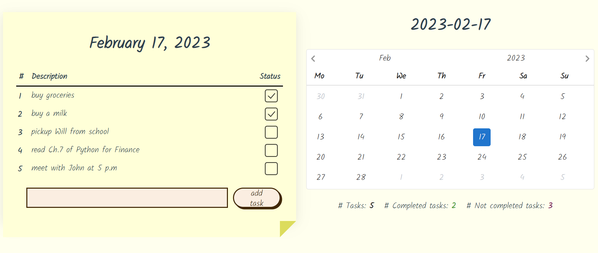
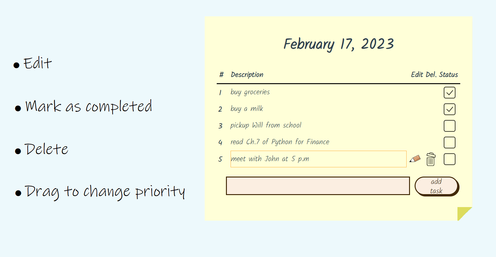
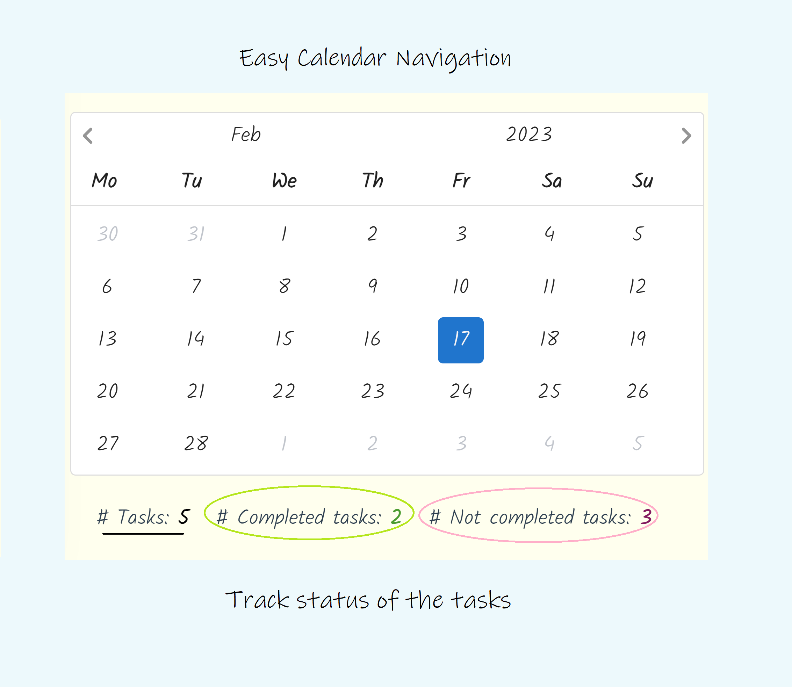
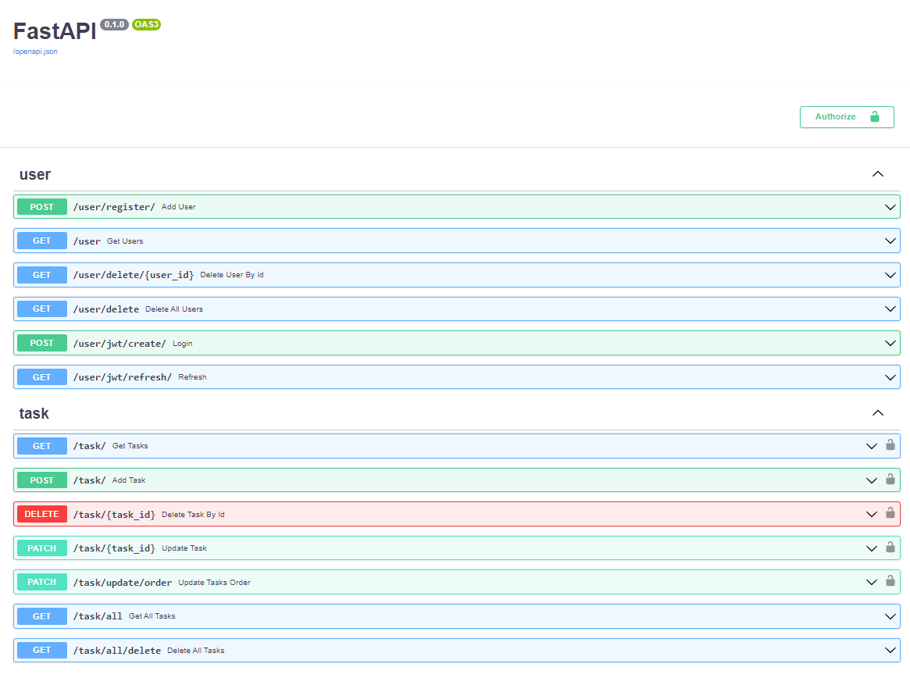

## Vue 3 and FastAPI

---

### Demo

https://www.stickydo.us

### Frontend

<ul>
    <li>
        
Latest Vue 3 <strong>Composition API</strong> Script Setup

    </li>
    <li>
        
<strong>Drag and drop</strong> functionality to change priority of tasks thanks to <a href="https://github.com/SortableJS/vue.draggable.next">Vue Draggable Next</a>

    </li>
    <li>
        
Date picker implemented using <a href="https://github.com/Vuepic/vue-datepicker">Vue Datepicker</a>

    </li>
    <li>
        
<strong>Pinia</strong> for state/store management

    </li>
    <li>
        
<strong>Axios</strong> for making HTTP Requests, including advanced interceptors usage to <strong>refresh</strong> JWT tokens

    </li>
</ul>

### Backend

<ul>
    <li>
        
FastAPI

    <li>
        
JWT refresh and access tokens for Authentication

    </li>
    <li>
        
Users may login using <strong>email</strong> or <strong>username</strong>

    </li>
    <li>
        
Open API/Swagger documentation available <a href="https://todoapp-vue3-fastapi-backend-production.up.railway.app/docs">Online</a>

    </li>
    <li>
        
SQLAlchemy ORM

    </li>
</ul>

